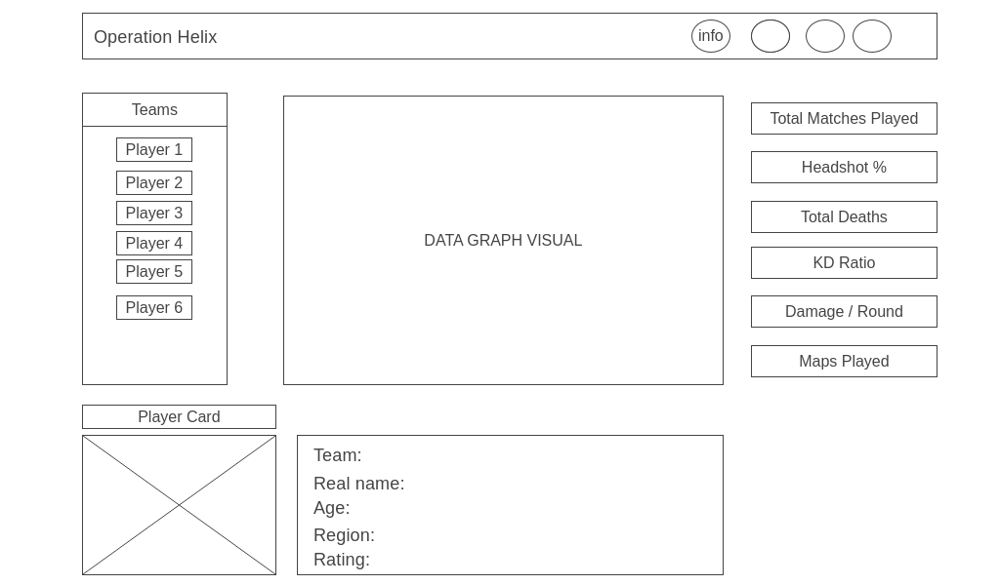

# Operation Helix

## Background
Operation Helix is a dashboard that provides Counter-Strike: Global Offensive esports fans the ability to analyze their favorite player's gameplay data and compare it to other players from different teams in an interactive way. The purpose of this dashboard is to allow the users to understand data trends and between different players visually. Users will be able to select specific players by their respective team and compare them across a variety of metrics through data graphs. Also a user will be able to view a player card when they select a certain player to view more stats.

## Functionality & MVPs
In Operation Helix, users will be able to:
- Sidebar for player selection based off teams
- Data visualize selected players in a graph
- Options to choose a certain metric to compare the players that a user wants to visualize in the graph
- Player card to display more info/stats about a specific player

In addition, this project will include:
- Ability to hover over a metric to explain what it is
- Ability to hover data in the graph to highlight a specific stat

## Wireframes

## Technologies, Libraries, APIs
- Vanilla Javascript
- HTML / CSS
- Considering either D3.js or Chart.js for data visualization
- [hltv-api](https://github.com/dajk/hltv-api) to source the professional CSGO players and teams statistics data
NPM and Webpack for JavaScript project management and file bundling

## Implementation Timeline
- Friday: Set up project and start implementing HTML, CSS and begin process of fetching data from the API.
- Weekend : Complete logic for data visualization using the data visual library of my choice and figure out how to implement the fetched data to appear on to the data graph.
- Monday : Continue solving any data visualization logic if need and start creating interactive buttons for navigation bar and player selector.
- Tuesday : Work on player card feature that will be fetched from api.
- Wednesday : Finish styling and refactoring code. If I have any extra time I will add some additional styling like animation to each button.
